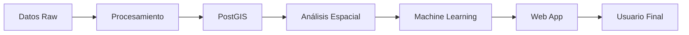

# 🗺️ Laboratorio Integrador - Análisis Geoespacial de Comuna Chilena

[](https://github.com/franciscoparrao)
[](https://github.com/franciscoparrao/geoinformatica)
[](LICENSE)

## 📋 Descripción

Proyecto integrador que combina todas las tecnologías y métodos aprendidos en las primeras 7 clases del curso de Geoinformática. Este laboratorio requiere desarrollar un análisis territorial completo de una comuna chilena, incluyendo procesamiento de datos espaciales, geoestadística, machine learning y visualización interactiva.

## 👥 Información del Equipo

| Integrante | Rol | GitHub |
|------------|-----|--------|
| [Nombre 1] | [Rol/Responsabilidad] | [@usuario1] |
| [Nombre 2] | [Rol/Responsabilidad] | [@usuario2] |

**Comuna seleccionada:** [NOMBRE DE LA COMUNA]
**Repositorio del curso:** [github.com/franciscoparrao/geoinformatica](https://github.com/franciscoparrao/geoinformatica)

## 🚀 Quick Start

### Prerrequisitos

- Docker Desktop instalado (versión 4.0+)
- Python 3.10 o superior
- Git
- Mínimo 8GB RAM disponible
- 20GB de espacio en disco

### Instalación Rápida

```bash
# 1. Clonar el repositorio
git clone https://github.com/franciscoparrao/geoinformatica.git
cd geoinformatica/laboratorio-integrador

# 2. Ejecutar script de configuración
chmod +x setup.sh
./setup.sh

# 3. Configurar variables de entorno
cp .env.example .env
# Editar .env con tus valores

# 4. Levantar servicios Docker
docker-compose up -d

# 5. Verificar instalación
docker-compose ps
```

### Acceso a Servicios

| Servicio | URL | Credenciales |
|----------|-----|--------------|
| Jupyter Lab | http://localhost:8888 | Token en .env |
| PostGIS | localhost:5432 | geouser/geopass |
| Web App | http://localhost:5000 | - |
| PgAdmin | http://localhost:5050 | admin@geoinformatica.cl/admin |

## 📁 Estructura del Proyecto

```
laboratorio_integrador/
├── 📄 README.md                 # Este archivo
├── 📋 requirements.txt          # Dependencias Python
├── 🐳 docker-compose.yml        # Configuración Docker
├── 🔒 .env                      # Variables de entorno (no subir!)
├── 📝 .gitignore               # Archivos ignorados
│
├── 🐳 docker/                  # Configuraciones Docker
│   ├── jupyter/                # Imagen personalizada Jupyter
│   ├── postgis/                # Inicialización PostGIS
│   └── web/                    # Aplicación web
│
├── 💾 data/                    # Datos del proyecto
│   ├── raw/                    # Datos originales sin procesar
│   ├── processed/              # Datos procesados y limpios
│   └── external/               # Datos de fuentes externas
│
├── 📓 notebooks/               # Análisis en Jupyter
│   ├── 01_data_acquisition.ipynb
│   ├── 02_exploratory_analysis.ipynb
│   ├── 03_geostatistics.ipynb
│   ├── 04_machine_learning.ipynb
│   └── 05_results_synthesis.ipynb
│
├── 🐍 scripts/                 # Scripts Python reutilizables
│   ├── download_data.py       # Descarga automatizada
│   ├── process_data.py        # Procesamiento
│   ├── spatial_analysis.py    # Análisis espacial
│   └── utils.py              # Funciones auxiliares
│
├── 🌐 app/                    # Aplicación web Streamlit
│   ├── main.py               # Aplicación principal
│   ├── pages/                # Páginas del dashboard
│   └── components/           # Componentes reutilizables
│
├── 📊 outputs/                # Resultados generados
│   ├── figures/              # Gráficos y mapas
│   ├── models/               # Modelos ML entrenados
│   └── reports/              # Informes y documentos
│
└── 📚 docs/                   # Documentación
    ├── guia_usuario.md       # Manual de usuario
    ├── arquitectura.md       # Arquitectura técnica
    └── api_reference.md      # Referencia API
```

## 🛠️ Configuración Detallada

### 1. Configuración del Entorno Python

```bash
# Crear ambiente virtual
python -m venv venv
```

Activación según tu shell / SO:

PowerShell (Windows):
```powershell
# Si ves error de ExecutionPolicy, primero:
Set-ExecutionPolicy -Scope CurrentUser -ExecutionPolicy RemoteSigned

# Activar
./venv/Scripts/Activate.ps1
```

CMD (Windows clásico):
```cmd
venv\Scripts\activate.bat
```

Git Bash (Windows):
```bash
source venv/Scripts/activate  # Nota: En Windows la carpeta es Scripts, no bin
```

Linux / macOS:
```bash
source venv/bin/activate
```

Verificar versión de Python dentro del entorno:
```powershell
python --version
```

Instalar dependencias del proyecto (host):
```powershell
pip install -r requirements.txt
```

Si el comando `python` falla en PowerShell, prueba:
```powershell
py -3 -m venv venv
py -3 --version
```

Desactivar el entorno:
```powershell
deactivate
```

Problemas comunes:
- ExecutionPolicy bloquea Activate.ps1: aplicar `Set-ExecutionPolicy` como arriba.
- Usaste `source venv/bin/activate` en Windows: reemplazar por ruta `Scripts`.
- Carpeta `venv` corrupta: borrar `venv/` y recrear.
- Múltiples instalaciones de Python: confirmar con `where python` (PowerShell) o `Get-Command python`.
```

### 2. Configuración de PostGIS

```bash
# Conectarse a la base de datos (servicio 'postgis')
docker compose exec postgis psql -U geouser -d geodatabase

# Verificar extensiones
\dx

# Debe mostrar:
# - postgis
# - postgis_topology
# - postgis_raster
# - pgrouting (si está instalado)
```

### 3. Descarga de Datos

```powershell
# Ejecutar script (desde la raíz del proyecto)
python scripts/download_data.py --comuna "La Florida" --sources all

# Omitir WFS IDE Chile si está lento:
python scripts/download_data.py --comuna "La Florida" --sources all --skip-wfs

# Solo OSM:
python scripts/download_data.py --comuna "La Florida" --sources osm

# Cambiar directorio de salida:
python scripts/download_data.py --comuna "La Florida" --output data/raw --sources all

# Opciones:
# --comuna     (obligatorio)
# --output     Directorio destino (default: data/raw)
# --sources    osm | ide | all (default: all)
# --skip-wfs   Omite descarga de límites administrativos (WFS)
```

> Nota: El parámetro `--year` mostrado anteriormente no está implementado en `scripts/download_data.py`. Si se requiere una noción de año, se puede añadir luego como nueva opción CLI.

### 3.1 DEM (SRTM) y Sistema de Referencia (CRS)

La descarga del Modelo Digital de Elevación (DEM) es parte de la ETAPA DE ADQUISICIÓN y se activa incluyendo `srtm` en `--sources`.
Los productos derivados (pendiente, orientación, NDVI, estadísticas zonales) pertenecen a la ETAPA DE PROCESAMIENTO y se agregarán más adelante (no los genera el script de descarga actual).

Archivos generados actualmente cuando se incluye la fuente `srtm`:
- `srtm_dem.tif` (EPSG:4326) DEM recortado a la comuna.
- `srtm_dem_32719.tif` (EPSG:32719) DEM reproyectado a UTM Zona 19 Sur para análisis métrico.

Fallback: Si todos los mirrors SRTM fallan, el código intenta Copernicus DEM GLO-30 (vía STAC) usando un bbox expandido. En ese caso se generan:
- `copernicus_dem.tif` (EPSG:4326)
- `copernicus_dem_32719.tif` (EPSG:32719)

Orden de mirrors SRTM intentados por tile:
1. `https://srtm.kurviger.de/SRTM3/{code}.hgt.gz`
2. `https://dds.cr.usgs.gov/srtm/version2_1/SRTM3/South_America/{code}.hgt.zip`
3. `https://srtm.kurviger.de/SRTM3/{code}.hgt`
4. `https://srtmtiles.s3.amazonaws.com/{code}.hgt.gz`
5. `https://s3.amazonaws.com/elevation-tiles-prod/skadi/{prefix}/{code}.hgt.gz` (Mapzen/Skadi)

Lógica principal:
- Se calcula la bounding box de la comuna y se determinan los códigos de tile por la esquina Suroeste (ej. `S33W071`).
- Se descargan sólo los tiles mínimos requeridos (comunas pequeñas suelen usar un único tile).
- Caso único tile: se recorta directamente; caso múltiple: mosaico con `rasterio.merge` y luego recorte.
- Se guarda el DEM en EPSG:4326 y luego se reproyecta automáticamente a EPSG:32719.

¿Por qué EPSG:32719?
- Zona UTM 19 Sur cubre gran parte de Chile central (distancias y áreas en metros).
- Evita distorsiones de cálculos métricos en lat/long (EPSG:4326).
- Consistencia con análisis posteriores (slope/aspect, buffers, interpolaciones, joins espaciales en PostGIS).

Verificación rápida:
```python
import rasterio, numpy as np
for f in ["data/raw/srtm_dem.tif", "data/raw/srtm_dem_32719.tif"]:
    with rasterio.open(f) as src:
        arr = src.read(1, masked=True)
        print(f, "CRS=", src.crs, "shape=", src.shape, "min/max=", np.nanmin(arr), np.nanmax(arr))
```

Próximos pasos (procesamiento):
- Generar `slope.tif` y `aspect.tif` desde `srtm_dem_32719.tif`.
- Calcular `sentinel2_ndvi.tif` (+ reproyección `sentinel2_ndvi_32719.tif`).
- Estadísticas zonales (elevación media, NDVI medio) por manzana censal.
- Ingesta de DEM y derivados a PostGIS.

Estas tareas se documentarán en una sección futura de "Procesamiento de Rasters".

### 4. Carga de Capas OSM a PostGIS

La carga está integrada en `scripts/process_data.py` (no se requiere script adicional). Ejemplos:

```powershell
# Host Windows (rutas locales)
python laboratorio_integrador\scripts\process_data.py --load-osm ^
    --buildings laboratorio_integrador\data\raw\osm_buildings.geojson ^
    --amenities laboratorio_integrador\data\raw\osm_amenities.geojson ^
    --schema raw_data ^
    --srid 32719

# Dentro del contenedor Jupyter
docker exec -it jupyter_lab python /home/jovyan/scripts/process_data.py --load-osm \
    --buildings /home/jovyan/data/raw/osm_buildings.geojson \
    --amenities /home/jovyan/data/raw/osm_amenities.geojson \
    --schema raw_data \
    --srid 32719
```

Verificación de carga:
```powershell
docker compose exec postgis psql -U geouser -d geodatabase -c "SELECT COUNT(*) AS edificios FROM raw_data.osm_buildings;"
docker compose exec postgis psql -U geouser -d geodatabase -c "SELECT COUNT(*) AS amenidades FROM raw_data.osm_amenities;"
```
Para confirmar SRID:
```powershell
docker compose exec postgis psql -U geouser -d geodatabase -c "SELECT 'osm_buildings' AS tabla, Find_SRID('raw_data','osm_buildings','geometry') UNION ALL SELECT 'osm_amenities', Find_SRID('raw_data','osm_amenities','geometry');"
```
Notas:
- Si omites `--srid` se conserva el CRS original.
- Esquema destino por defecto: `raw_data`.

### Acceso a Jupyter Lab

Al abrir `http://localhost:8888` se solicitará "Password or token". Usa el valor de `JUPYTER_TOKEN` definido en tu archivo `.env` (actual: `laboratorio2025`). También puedes obtener el token desde los logs del contenedor si se configurara dinámicamente.

## 📊 Flujo de Trabajo

### Fase 1: Preparación de Datos (Semana 1)

- [ ] Seleccionar comuna de estudio
- [ ] Configurar ambiente de desarrollo
- [ ] Descargar datos de múltiples fuentes
- [ ] Cargar datos en PostGIS
- [ ] Validar calidad de datos

### Fase 2: Análisis Espacial (Semana 2)

- [ ] Análisis exploratorio (ESDA)
- [ ] Calcular autocorrelación espacial
- [ ] Identificar hot spots y clusters
- [ ] Crear visualizaciones temáticas
- [ ] Análisis geoestadístico

### Fase 3: Machine Learning y Aplicación (Semana 3)

- [ ] Feature engineering espacial
- [ ] Entrenar modelos predictivos
- [ ] Validación espacial
- [ ] Desarrollar aplicación web
- [ ] Documentar resultados

## 🔬 Análisis Incluidos

### 1. Análisis Exploratorio de Datos Espaciales (ESDA)
- Estadísticas descriptivas espaciales
- Mapas de distribución
- Análisis de patrones

### 2. Autocorrelación Espacial
- Índice de Moran Global
- LISA (Local Indicators of Spatial Association)
- Getis-Ord G*

### 3. Geoestadística
- Semivariogramas
- Kriging ordinario
- Validación cruzada

### 4. Machine Learning Geoespacial
- Random Forest espacial
- XGBoost con features geográficos
- Validación espacial (no random!)

### 5. Visualización Interactiva
- Dashboard Streamlit
- Mapas interactivos con Folium
- Gráficos dinámicos con Plotly

## 🌐 Aplicación Web

### Ejecutar la aplicación

```bash
# Desarrollo
streamlit run app/main.py

# Producción con Docker
docker-compose up web
```

### Características principales

- 🗺️ Mapa interactivo con múltiples capas
- 📈 Gráficos dinámicos de estadísticas
- 🤖 Panel de predicciones ML
- 💾 Descarga de resultados
- 📱 Diseño responsive

## 📝 Notebooks

### 1. `01_data_acquisition.ipynb`
Descarga y carga inicial de datos desde múltiples fuentes.

### 2. `02_exploratory_analysis.ipynb`
ESDA completo con visualizaciones y estadísticas.

### 3. `03_geostatistics.ipynb`
Análisis geoestadístico y interpolación espacial.

### 4. `04_machine_learning.ipynb`
Modelos predictivos con validación espacial.

### 5. `05_results_synthesis.ipynb`
Síntesis de resultados y conclusiones.

## 🧪 Testing

```bash
# Ejecutar tests unitarios
pytest tests/

# Ejecutar con coverage
pytest --cov=scripts tests/

# Verificar calidad del código
flake8 scripts/ app/
black --check scripts/ app/
```

## 📈 Monitoreo y Logs

```bash
# Ver logs de todos los servicios
docker-compose logs -f

# Logs de un servicio específico
docker-compose logs -f postgis

# Estado de los contenedores
docker stats
```

## 🐛 Troubleshooting

### Problema: Puerto en uso
```bash
# Verificar puertos en uso
sudo lsof -i :8888
sudo lsof -i :5432

# Matar proceso
kill -9 [PID]
```

### Problema: Falta de memoria Docker
```bash
# Aumentar memoria en Docker Desktop
# Settings -> Resources -> Memory -> 8GB mínimo
```

### Problema: Error de permisos
```bash
# Linux/Mac
sudo chown -R $USER:$USER .

# Dar permisos de ejecución
chmod +x scripts/*.py
```

## 📚 Recursos y Referencias

### Documentación Oficial
- [GeoPandas](https://geopandas.org)
- [PySAL](https://pysal.org)
- [OSMnx](https://osmnx.readthedocs.io)
- [Streamlit](https://docs.streamlit.io)
- [PostGIS](https://postgis.net/docs/)

### Fuentes de Datos
- [IDE Chile](https://www.ide.cl)
- [INE Chile](https://www.ine.cl)
- [OpenStreetMap](https://www.openstreetmap.org)
- [Google Earth Engine](https://earthengine.google.com)
- [Sentinel Hub](https://www.sentinel-hub.com)

### Tutoriales Recomendados
- [Automating GIS Processes](https://automating-gis-processes.github.io)
- [Geographic Data Science](https://geographicdata.science)
- [Spatial Thoughts](https://spatialthoughts.com)

## 👨‍💻 Desarrollo

### Convenciones de código

- Python: PEP 8
- Commits: Conventional Commits
- Branches: `feature/nombre`, `fix/nombre`, `docs/nombre`

### Flujo de Git

```bash
# Crear rama para nueva característica
git checkout -b feature/analisis-clustering

# Hacer cambios y commit
git add .
git commit -m "feat: agregar análisis de clustering DBSCAN"

# Push y crear PR
git push origin feature/analisis-clustering
```

## 📊 Métricas del Proyecto


### Estadísticas de código

- Líneas de código Python: [XXX]
- Notebooks Jupyter: 5
- Tests escritos: [XX]
- Coverage: [XX]%

## 📄 Licencia

Este proyecto fue desarrollado como parte del curso de Geoinformática en USACH.

## 🙏 Agradecimientos

- Prof. Francisco Parra O. por la guía y enseñanza
- Compañeros de curso por el feedback
- Comunidad Open Source por las herramientas

## 📧 Contacto

Para consultas sobre el proyecto:
- Email: [tu-email@usach.cl]
- GitHub Issues: [github.com/franciscoparrao/geoinformatica/issues](https://github.com/franciscoparrao/geoinformatica/issues)
- Repositorio: [github.com/franciscoparrao/geoinformatica](https://github.com/franciscoparrao/geoinformatica)

---

**Última actualización:** $(date)

**Estado del proyecto:** 🚧 En desarrollo

