# 🗺️ Laboratorio Integrador - Análisis Geoespacial de Comuna Chilena

[](https://github.com/franciscoparrao)
[](https://github.com/franciscoparrao/geoinformatica)
[](LICENSE)

## 📋 Descripción

Proyecto integrador que combina todas las tecnologías y métodos aprendidos en las primeras 7 clases del curso de Geoinformática. Este laboratorio requiere desarrollar un análisis territorial completo de una comuna chilena, incluyendo procesamiento de datos espaciales, geoestadística, machine learning y visualización interactiva.

## 👥 Información del Equipo

| Integrante | Rol | GitHub |
|------------|-----|--------|
| [Nombre 1] | [Rol/Responsabilidad] | [@usuario1] |
| [Nombre 2] | [Rol/Responsabilidad] | [@usuario2] |

**Comuna seleccionada:** [NOMBRE DE LA COMUNA]
**Repositorio del curso:** [github.com/franciscoparrao/geoinformatica](https://github.com/franciscoparrao/geoinformatica)

## 🚀 Quick Start

### Prerrequisitos

- Docker Desktop instalado (versión 4.0+)
- Python 3.10 o superior
- Git
- Mínimo 8GB RAM disponible
- 20GB de espacio en disco

### Instalación Rápida

```bash
# 1. Clonar el repositorio
git clone https://github.com/franciscoparrao/geoinformatica.git
cd geoinformatica/laboratorio-integrador

# 2. Ejecutar script de configuración
chmod +x setup.sh
./setup.sh

# 3. Configurar variables de entorno
cp .env.example .env
# Editar .env con tus valores

# 4. Levantar servicios Docker
docker-compose up -d

# 5. Verificar instalación
docker-compose ps
```

### Acceso a Servicios

| Servicio | URL | Credenciales |
|----------|-----|--------------|
| Jupyter Lab | http://localhost:8888 | Token en .env |
| PostGIS | localhost:5432 | geouser/geopass |
| Web App | http://localhost:5000 | - |
| PgAdmin | http://localhost:5050 | admin@geoinformatica.cl/admin |

## 📁 Estructura del Proyecto

```
laboratorio_integrador/
├── 📄 README.md                 # Este archivo
├── 📋 requirements.txt          # Dependencias Python
├── 🐳 docker-compose.yml        # Configuración Docker
├── 🔒 .env                      # Variables de entorno (no subir!)
├── 📝 .gitignore               # Archivos ignorados
│
├── 🐳 docker/                  # Configuraciones Docker
│   ├── jupyter/                # Imagen personalizada Jupyter
│   ├── postgis/                # Inicialización PostGIS
│   └── web/                    # Aplicación web
│
├── 💾 data/                    # Datos del proyecto
│   ├── raw/                    # Datos originales sin procesar
│   ├── processed/              # Datos procesados y limpios
│   └── external/               # Datos de fuentes externas
│
├── 📓 notebooks/               # Análisis en Jupyter
│   ├── 01_data_acquisition.ipynb
│   ├── 02_exploratory_analysis.ipynb
│   ├── 03_geostatistics.ipynb
│   ├── 04_machine_learning.ipynb
│   └── 05_results_synthesis.ipynb
│
├── 🐍 scripts/                 # Scripts Python reutilizables
│   ├── download_data.py       # Descarga automatizada
│   ├── process_data.py        # Procesamiento
│   ├── spatial_analysis.py    # Análisis espacial
│   └── utils.py              # Funciones auxiliares
│
├── 🌐 app/                    # Aplicación web Streamlit
│   ├── main.py               # Aplicación principal
│   ├── pages/                # Páginas del dashboard
│   └── components/           # Componentes reutilizables
│
├── 📊 outputs/                # Resultados generados
│   ├── figures/              # Gráficos y mapas
│   ├── models/               # Modelos ML entrenados
│   └── reports/              # Informes y documentos
│
└── 📚 docs/                   # Documentación
    ├── guia_usuario.md       # Manual de usuario
    ├── arquitectura.md       # Arquitectura técnica
    └── api_reference.md      # Referencia API
```

## 🛠️ Configuración Detallada

### 1. Configuración del Entorno Python

```bash
# Crear ambiente virtual
python -m venv venv
```

Activación según tu shell / SO:

PowerShell (Windows):
```powershell
# Si ves error de ExecutionPolicy, primero:
Set-ExecutionPolicy -Scope CurrentUser -ExecutionPolicy RemoteSigned

# Activar
./venv/Scripts/Activate.ps1
```

CMD (Windows clásico):
```cmd
venv\Scripts\activate.bat
```

Git Bash (Windows):
```bash
source venv/Scripts/activate  # Nota: En Windows la carpeta es Scripts, no bin
```

Linux / macOS:
```bash
source venv/bin/activate
```

Verificar versión de Python dentro del entorno:
```powershell
python --version
```

Instalar dependencias del proyecto (host):
```powershell
pip install -r requirements.txt
```

Si el comando `python` falla en PowerShell, prueba:
```powershell
py -3 -m venv venv
py -3 --version
```

Desactivar el entorno:
```powershell
deactivate
```

Problemas comunes:
- ExecutionPolicy bloquea Activate.ps1: aplicar `Set-ExecutionPolicy` como arriba.
- Usaste `source venv/bin/activate` en Windows: reemplazar por ruta `Scripts`.
- Carpeta `venv` corrupta: borrar `venv/` y recrear.
- Múltiples instalaciones de Python: confirmar con `where python` (PowerShell) o `Get-Command python`.
```

### 2. Configuración de PostGIS

```bash
# Conectarse a la base de datos (servicio 'postgis')
docker compose exec postgis psql -U geouser -d geodatabase

# Verificar extensiones
\dx

# Debe mostrar:
# - postgis
# - postgis_topology
# - postgis_raster
# - pgrouting (si está instalado)
```

### 3. Descarga de Datos

```powershell
# Ejecutar script (desde la raíz del proyecto)
python scripts/download_data.py --comuna "La Florida" --sources all

# Omitir WFS IDE Chile si está lento:
python scripts/download_data.py --comuna "La Florida" --sources all --skip-wfs

# Solo OSM:
python scripts/download_data.py --comuna "La Florida" --sources osm

# Cambiar directorio de salida:
python scripts/download_data.py --comuna "La Florida" --output data/raw --sources all

# Opciones:
# --comuna     (obligatorio)
# --output     Directorio destino (default: data/raw)
# --sources    osm | ide | all (default: all)
# --skip-wfs   Omite descarga de límites administrativos (WFS)
```

> Nota: El parámetro `--year` mostrado anteriormente no está implementado en `scripts/download_data.py`. Si se requiere una noción de año, se puede añadir luego como nueva opción CLI.

### 3.1 DEM (SRTM) y Sistema de Referencia (CRS)

La descarga del Modelo Digital de Elevación (DEM) es parte de la ETAPA DE ADQUISICIÓN y se activa incluyendo `srtm` en `--sources`.
Los productos derivados (pendiente, orientación, NDVI, estadísticas zonales) pertenecen a la ETAPA DE PROCESAMIENTO y se agregarán más adelante (no los genera el script de descarga actual).

Archivos generados actualmente cuando se incluye la fuente `srtm`:
- `srtm_dem.tif` (EPSG:4326) DEM recortado a la comuna.
- `srtm_dem_32719.tif` (EPSG:32719) DEM reproyectado a UTM Zona 19 Sur para análisis métrico.

Fallback: Si todos los mirrors SRTM fallan, el código intenta Copernicus DEM GLO-30 (vía STAC) usando un bbox expandido. En ese caso se generan:
- `copernicus_dem.tif` (EPSG:4326)
- `copernicus_dem_32719.tif` (EPSG:32719)

Orden de mirrors SRTM intentados por tile:
1. `https://srtm.kurviger.de/SRTM3/{code}.hgt.gz`
2. `https://dds.cr.usgs.gov/srtm/version2_1/SRTM3/South_America/{code}.hgt.zip`
3. `https://srtm.kurviger.de/SRTM3/{code}.hgt`
4. `https://srtmtiles.s3.amazonaws.com/{code}.hgt.gz`
5. `https://s3.amazonaws.com/elevation-tiles-prod/skadi/{prefix}/{code}.hgt.gz` (Mapzen/Skadi)

Lógica principal:
- Se calcula la bounding box de la comuna y se determinan los códigos de tile por la esquina Suroeste (ej. `S33W071`).
- Se descargan sólo los tiles mínimos requeridos (comunas pequeñas suelen usar un único tile).
- Caso único tile: se recorta directamente; caso múltiple: mosaico con `rasterio.merge` y luego recorte.
- Se guarda el DEM en EPSG:4326 y luego se reproyecta automáticamente a EPSG:32719.

¿Por qué EPSG:32719?
- Zona UTM 19 Sur cubre gran parte de Chile central (distancias y áreas en metros).
- Evita distorsiones de cálculos métricos en lat/long (EPSG:4326).
- Consistencia con análisis posteriores (slope/aspect, buffers, interpolaciones, joins espaciales en PostGIS).

Verificación rápida:
```python
import rasterio, numpy as np
for f in ["data/raw/srtm_dem.tif", "data/raw/srtm_dem_32719.tif"]:
    with rasterio.open(f) as src:
        arr = src.read(1, masked=True)
        print(f, "CRS=", src.crs, "shape=", src.shape, "min/max=", np.nanmin(arr), np.nanmax(arr))
```

Próximos pasos (procesamiento):
- Generar `slope.tif` y `aspect.tif` desde `srtm_dem_32719.tif`.
- Calcular `sentinel2_ndvi.tif` (+ reproyección `sentinel2_ndvi_32719.tif`).
- Estadísticas zonales (elevación media, NDVI medio) por manzana censal.
- Ingesta de DEM y derivados a PostGIS.

Estas tareas se documentarán en una sección futura de "Procesamiento de Rasters".

### 4. Carga y Procesamiento Inicial (OSM + DEM + Enriquecimientos)

La ingesta y primeros derivados se ejecutan con `scripts/process_data.py`. Se implementó autodetección de rutas para edificios, amenidades y el tile SRTM (`*.hgt`).

#### 4.1 Comando mínimo (ingesta OSM autodetectada)
```powershell
python scripts/process_data.py --load-osm --srid 32719 --index
```

#### 4.2 Especificar rutas manuales (PowerShell)
Usar backtick `` ` `` para continuar línea (no usar `^` en PowerShell):
```powershell
python scripts/process_data.py --load-osm `
    --buildings data/raw/osm_buildings.geojson `
    --amenities data/raw/osm_amenities.geojson `
    --schema raw_data `
    --srid 32719 `
    --index
```
Una sola línea equivalente:
```powershell
python scripts/process_data.py --load-osm --buildings data/raw/osm_buildings.geojson --amenities data/raw/osm_amenities.geojson --schema raw_data --srid 32719 --index
```

#### 4.3 Dentro del contenedor Jupyter
```bash
docker exec -it jupyter_lab python /home/jovyan/scripts/process_data.py --load-osm \
    --schema raw_data \
    --srid 32719 --index
```
Si los archivos están en `/home/jovyan/data/raw/` no hace falta indicar rutas.

#### 4.4 Derivados del DEM (slope/aspect)
```powershell
python scripts/process_data.py --dem-derivatives
```
Combinar ingesta OSM y derivados:
```powershell
python scripts/process_data.py --load-osm --srid 32719 --index --dem-derivatives
```
Genera:
- `data/raw/srtm_dem.tif`
- `data/raw/srtm_dem_32719.tif`
- `data/processed/slope.tif`
- `data/processed/aspect.tif`

#### 4.5 Flags futuros (pendientes)
Los siguientes flags ya están añadidos en la CLI. Algunos requieren que existan previamente los archivos de entrada en `data/raw/`.

| Flag | Entrada esperada | Salida en `data/processed/` | Descripción |
|------|------------------|------------------------------|-------------|
| `--ndvi` | `sentinel_B04.tif`, `sentinel_B08.tif` | `sentinel2_ndvi.tif`, `sentinel2_ndvi_<SRID>.tif` | Calcula NDVI y reproyecta si se usa `--srid` |
| `--join-censo` | Carpeta `Censo2017_ManzanaEntidad_CSV/` y `manzanas_censales.geojson` | `manzanas_atributos.geojson` | Une microdatos INE con geometrías de manzana (heurística de clave) |
| `--join-uso-suelo` | `uso_suelo_minvu.geojson`, `manzanas_censales.geojson` | `manzanas_uso_suelo.geojson` | Intersecta para obtener área zonificada y conteo de zonas |
| `--metrics` | Manzanas, edificios, amenidades + (opcional joins previos) | `metrics_manzanas.csv` | Conteos de edificios, amenidades, área y agrega atributos disponibles |

Ejemplos de ejecución:
```powershell
# NDVI (si existen bandas Sentinel-2)
python scripts/process_data.py --ndvi --srid 32719

# Join Censo y Uso Suelo en una sola corrida
python scripts/process_data.py --join-censo --join-uso-suelo

# Métricas luego de haber generado los joins previos
python scripts/process_data.py --metrics

# Pipeline combinado OSM + DEM + Censo + Uso Suelo + Métricas
python scripts/process_data.py --load-osm --dem-derivatives --join-censo --join-uso-suelo --metrics --srid 32719 --index
```

Consideraciones:
- Si un archivo de salida ya existe se reutiliza para mantener idempotencia.
- `--join-censo` intenta detectar automáticamente la columna clave (ej. `MANZENT`). Si no la encuentra, selecciona la primera columna común; revisar log si falta alguna variable.
- `--join-uso-suelo` agrega columnas `area_zonas` y `zonas_count` al resultado por manzana.
- `--metrics` agrega columnas de conteo y área; si existen outputs de censo y uso suelo los incorpora mediante join.

#### 4.6 Extensiones recientes (NDVI flexible, uso suelo unificado, red vial, catálogo raster)

Se han incorporado nuevas capacidades al script `scripts/process_data.py` para enriquecer el pipeline:

| Flag | Entradas Clave | Salidas | Detalles |
|------|----------------|---------|----------|
| `--unify-uso-suelo` | Shapefiles en `data/raw/uso_suelo_minvu/**` (PRC*, PRMS*, LU*) | `uso_suelo_unificado.geojson` | Unifica múltiples fuentes, normaliza campo `categoria` y agrega `source`|
| `--network-metrics` | `osm_network.graphml`, `manzanas_censales.geojson` | `network_nodes_metrics.geojson`, `network_metrics.csv` | Centralidades (degree, betweenness) y densidad vial por manzana |
| `--ndvi` | Bandas B04/B08 (nombres soportados) | `sentinel2_ndvi.tif`, `sentinel2_ndvi_<SRID>.tif` | Detección flexible nombres: `sentinel_B04/B08`, `sentinel2_B04/B08`, fallback `*_B04/_B08` |
| `--ingest-processed` | Archivos en `data/processed` | Tablas en esquema `processed_data` + `raster_catalog` | Carga `.geojson` y `.csv`; cataloga metadatos `.tif` |

Detección flexible NDVI:
1. Busca pares exactos (`sentinel_B04.tif`, `sentinel_B08.tif`).
2. Luego (`sentinel2_B04.tif`, `sentinel2_B08.tif`).
3. Fallback: primer par que cumpla patrón genérico `*_B04.tif` y `*_B08.tif`.
Si dimensiones o transform difieren se aborta para evitar NDVI inválido.

Catálogo raster (`processed_data.raster_catalog`):
- Se crea automáticamente al ejecutar `--ingest-processed` si existen `.tif` en `data/processed`.
- Guarda metadatos (crs, ancho/alto, bounds, transform, nodata, dtype, band_count) para reproducibilidad.
- No almacena los píxeles en la base (optimiza espacio); el filesystem sigue siendo fuente de verdad.

Consulta rápida en contenedor PostGIS:
```powershell
docker compose exec postgis psql -U geouser -d geodatabase -c "SELECT filename, crs, width, height, band_count FROM processed_data.raster_catalog;"
```

En Windows PowerShell local (si tienes `psql` instalado):
```powershell
psql -h localhost -p 5432 -U geouser -d geodatabase -c "SELECT * FROM processed_data.raster_catalog LIMIT 5;"
```
Nota: No ejecutes `SELECT ...` directamente en PowerShell sin `psql -c`; PowerShell interpretará `SELECT` como comando de su propio pipeline.

#### 4.7 Tabla de trazabilidad Raw → Processed

| Archivo Raw | Tipo | Transformación / Acción | Archivo(s) Processed | Flag / Paso |
|-------------|------|-------------------------|----------------------|-------------|
| `osm_buildings.geojson` | Vector | Reproyección opcional, ingesta PostGIS | (tabla `raw_data.osm_buildings`) | `--load-osm` |
| `osm_amenities.geojson` | Vector | Reproyección opcional, ingesta PostGIS | (tabla `raw_data.osm_amenities`) | `--load-osm` |
| `osm_network.graphml` | Grafo | Parse nodos/aristas, reproyección | `network_nodes_metrics.geojson`, `network_metrics.csv` | `--network-metrics` |
| `manzanas_censales.geojson` | Vector | Base para joins y métricas | `manzanas_atributos.geojson`, `manzanas_uso_suelo.geojson`, `metrics_manzanas.csv` | `--join-censo`, `--join-uso-suelo`, `--metrics` |
| Censo CSV (`Censo2017_Manzanas.csv`) | Tabular | Limpieza separador y normalización clave | `manzanas_atributos.geojson` | `--join-censo` |
| Uso suelo (PRC*, PRMS*, LU*) | Vector | Unificación + normalización categorías | `uso_suelo_unificado.geojson` | `--unify-uso-suelo` |
| `uso_suelo_minvu.geojson` | Vector | Intersección con manzanas | `manzanas_uso_suelo.geojson` | `--join-uso-suelo` |
| `S34W071.hgt` | Raster | Conversión HGT→GeoTIFF, recorte comuna, reproyección | `srtm_dem.tif`, `srtm_dem_32719.tif`, `slope.tif`, `aspect.tif` | `--dem-derivatives` |
| Bandas Sentinel (B04/B08) | Raster | Cálculo NDVI + reproyección | `sentinel2_ndvi.tif`, `sentinel2_ndvi_<SRID>.tif` | `--ndvi` |

Reglas de almacenamiento:
- `data/raw/`: sólo fuentes originales sin modificación (HGT, GraphML, shapefiles, GeoJSON base, bandas).
- `data/processed/`: productos derivados, agregados, reproyectados, enriquecidos o normalizados.
- Evitar copiar archivos sin transformación a `processed/` para no duplicar almacenamiento; usar tabla de trazabilidad para referencia.
- Rasters derivados se catalogan en `processed_data.raster_catalog` al ejecutar `--ingest-processed`.

Ejemplo de pipeline completo (incluyendo catalogación raster):
```powershell
python scripts/process_data.py \
    --load-osm --dem-derivatives --ndvi --join-censo --join-uso-suelo \
    --metrics --unify-uso-suelo --network-metrics --srid 32719
python scripts/process_data.py --ingest-processed --processed-schema processed_data
```

#### 4.8 Ingesta mínima de fuentes base

La bandera `--ingest-minimum` carga en PostGIS las fuentes originales mínimas (límite oficial, manzanas censales, uso_suelo_minvu consolidado, microdatos censo) y cataloga los rasters base (DEM y bandas Sentinel) sin mover píxeles a la base.

Acciones:
- Vectoriales → tablas (`comuna_boundaries_oficial`, `manzanas_censales`, `uso_suelo_minvu`).
- Microdatos censo → tabla `censo_microdatos` (primeras columnas para ligereza).
- Rasters base → filas en `{schema}.raster_catalog` con `source_group='raw'`.

Comando recomendado (añade índices y reproyección):
```powershell
python scripts/process_data.py --ingest-minimum --srid 32719 --index
```
Luego ejecutar derivados y productos y cargarlos al esquema de procesados:
```powershell
python scripts/process_data.py --dem-derivatives --ndvi --join-censo --join-uso-suelo --metrics --unify-uso-suelo --network-metrics --srid 32719
python scripts/process_data.py --ingest-processed --processed-schema processed_data
```

Verificación rápida de métricas:
```powershell
docker compose exec postgis psql -U geouser -d geodatabase -c "SELECT COUNT(*) FROM processed_data.metrics_manzanas;"
docker compose exec postgis psql -U geouser -d geodatabase -c "SELECT AVG(ndvi_mean) FROM processed_data.metrics_manzanas;"
docker compose exec postgis psql -U geouser -d geodatabase -c "SELECT AVG(road_density_m_per_km2) FROM processed_data.network_metrics;"
```

#### 4.8.1 Validación de claves huérfanas (Censo ↔ Manzanas) y cobertura

Objetivo: comprobar qué microdatos del censo no encuentran geometría y la cobertura (%) de manzanas con atributos censales / métricas derivadas.

1. Listar columnas disponibles en la tabla de microdatos (para confirmar nombre real de la clave):
```powershell
docker compose exec postgis psql -U geouser -d geodatabase -c "SELECT column_name FROM information_schema.columns WHERE table_schema='raw_data' AND table_name='censo_microdatos';"
```

2. Contar total de registros y total de manzanas:
```powershell
docker compose exec postgis psql -U geouser -d geodatabase -c "SELECT COUNT(*) AS total_microdatos FROM raw_data.censo_microdatos;"
docker compose exec postgis psql -U geouser -d geodatabase -c "SELECT COUNT(*) AS total_manzanas FROM raw_data.manzanas_censales;"
```

3. Detección de claves huérfanas (usa COALESCE para variantes comunes de la clave):
```powershell
docker compose exec postgis psql -U geouser -d geodatabase -c "SELECT COUNT(*) AS microdatos_sin_geometria FROM raw_data.censo_microdatos c LEFT JOIN raw_data.manzanas_censales m ON COALESCE(c.manzent::text, c.id_manzent::text, c.mz_ent::text, c.manzana::text) = m.manzent::text WHERE m.manzent IS NULL;"
```

4. Proporción de microdatos que sí tienen geometría:
```powershell
docker compose exec postgis psql -U geouser -d geodatabase -c "SELECT ROUND(100.0*COUNT(*)/(SELECT COUNT(*) FROM raw_data.censo_microdatos),2) AS pct_microdatos_con_geometria FROM raw_data.censo_microdatos c JOIN raw_data.manzanas_censales m ON COALESCE(c.manzent::text, c.id_manzent::text, c.mz_ent::text, c.manzana::text) = m.manzent::text;"
```

5. Cobertura de manzanas con atributos censales en producto procesado (`manzanas_atributos`):
```powershell
docker compose exec postgis psql -U geouser -d geodatabase -c "SELECT ROUND(100.0*COUNT(*)/(SELECT COUNT(*) FROM processed_data.manzanas_atributos),2) AS pct_manzanas_con_microdatos FROM processed_data.manzanas_atributos WHERE manzent IS NOT NULL;"
```

6. Estadísticos NDVI para validar rango esperado (solo valores no nulos):
```powershell
docker compose exec postgis psql -U geouser -d geodatabase -c "SELECT MIN(ndvi_mean), MAX(ndvi_mean), AVG(ndvi_mean) FROM processed_data.metrics_manzanas WHERE ndvi_mean IS NOT NULL;"
```

7. (Opcional) Crear vista con clave canónica para futuras consultas:
```powershell
docker compose exec postgis psql -U geouser -d geodatabase -c "CREATE OR REPLACE VIEW raw_data.censo_microdatos_canon AS SELECT COALESCE(manzent, id_manzent, mz_ent, manzana) AS manzent_canon, * FROM raw_data.censo_microdatos;"
```

Notas:
- No usar barras invertidas `\"` en PowerShell: simplemente encierra todo el SQL entre comillas dobles.
- Si la columna aparece como `ID_MANZENT` o `MZ_ENT`, el script de ingest mínima la normaliza a `MANZENT` (nuevo ajuste). Si aún no existe, usar la variante adecuada en COALESCE.
- Postgres convierte identificadores no entrecomillados a minúsculas; `MANZENT` y `manzent` son equivalentes si no se usan comillas dobles alrededor del nombre.
- El CSV original del censo trae a veces espacios finales en los headers (ej. `PUEBLO  `). El script ahora limpia (strip) todos los nombres y unifica la clave a `MANZENT` cuando encuentra alias (`ID_MANZENT`, `MZ_ENT`, `MANZANA`). Si ves ambas columnas `MZ_ENT` y `MANZENT`, la primera se dejó porque ya existía la segunda antes de normalizar.

#### 4.8.2 NDVI y Métricas Zonales

El NDVI se genera con el flag `--ndvi` usando bandas B04 (red) y B08 (nir). Se soportan nombres:
`sentinel_B04.tif` / `sentinel_B08.tif`, `sentinel2_B04.tif` / `sentinel2_B08.tif`, o cualquier par `*_B04.tif` y `*_B08.tif` (fallback).

Comando de generación (reproyecta si se entrega `--srid`):
```powershell
python scripts/process_data.py --ndvi --srid 32719
```
Salida:
- `data/processed/sentinel2_ndvi.tif`
- `data/processed/sentinel2_ndvi_32719.tif` (si se solicitó reproyección)

Registro en catálogo: al existir `raw_data.raster_catalog` se inserta metadato con `source_group='derived'`.

Para agregar la media de NDVI por manzana (estadística zonal) ejecutar luego:
```powershell
python scripts/process_data.py --metrics --srid 32719
```
Si el NDVI ya existía, la función lo reutiliza. La columna resultante en `metrics_manzanas.csv` es `ndvi_mean`.

Validación rápida de rango típico NDVI (-1 a 1):
```powershell
docker compose exec postgis psql -U geouser -d geodatabase -c "SELECT MIN(ndvi_mean), MAX(ndvi_mean), AVG(ndvi_mean) FROM processed_data.metrics_manzanas WHERE ndvi_mean IS NOT NULL;"
```

#### 4.8.3 Registro y Manejo de Fila Huérfana del Censo

Se detectó una fila huérfana (microdato sin geometría asociada) con clave:
```
MANZENT = 13129991999999
```
Patrón sugiere código especial (relleno / fuera de límite). Recomendación: excluir esta fila en análisis estadísticos y mapas para evitar sesgos.

SQL para excluirla en consultas posteriores:
```sql
SELECT * FROM raw_data.censo_microdatos WHERE manzent <> '13129991999999';
```

Python (GeoPandas/Pandas) al cargar atributos:
```python
df = df[df['manzent'] != '13129991999999']
```

Si aparecieran más casos, generar reporte actualizado:
```powershell
python scripts/report_orphans.py --output data/processed/orphans_microdatos.csv
```

#### 4.8.4 DEM Copernicus (Opcional)

Si se añade archivo `copernicus_dem.tif` (o se descarga vía flujo externo), se puede ejecutar reproyección y cálculo de derivados para comparar calidad vs SRTM:
```powershell
python scripts/process_data.py --dem-derivatives --srid 32719
```
El script intentará crear `copernicus_dem_32719.tif` y reutilizar derivados si ya existen `slope.tif` / `aspect.tif`. Para mantener trazabilidad, documentar en el catálogo raster la procedencia (`source_group='raw'` para DEM base Copernicus, `source_group='derived'` para derivados).

Comparación rápida de estadísticas básicas entre DEMs (en Python interactivo):
```python
import rasterio, numpy as np
for f in ["data/raw/srtm_dem_32719.tif", "data/raw/copernicus_dem_32719.tif"]:
    if not Path(f).exists():
        print("Falta", f); continue
    with rasterio.open(f) as src:
        arr = src.read(1, masked=True)
        print(f, "min", float(np.nanmin(arr)), "max", float(np.nanmax(arr)), "mean", float(np.nanmean(arr)))
```

Justificación opcional en informe: Copernicus GLO-30 suele ofrecer menor ruido y mayor cobertura homogénea; comparar histograma y pendiente media puede apoyar elección final de DEM para análisis topográfico avanzado.

### Buenas Prácticas de Reproducibilidad
- Mantener `.env` con variables de conexión; no subir credenciales reales.
- Ejecutar scripts con flags explícitos para poder reconstruir outputs.
- Versionar sólo derivados compactos; evitar subir tiles raster gigantes si no cambian.
- Usar logs para verificar idempotencia ("ya existe, reutilizando").

---

Sigue la documentación original abajo para fases analíticas avanzadas.

#### Verificación de carga OSM
```powershell
docker compose exec postgis psql -U geouser -d geodatabase -c "SELECT COUNT(*) AS edificios FROM raw_data.osm_buildings;"
docker compose exec postgis psql -U geouser -d geodatabase -c "SELECT COUNT(*) AS amenidades FROM raw_data.osm_amenities;"
```
Confirmar SRID:
```powershell
docker compose exec postgis psql -U geouser -d geodatabase -c "SELECT 'osm_buildings' AS tabla, Find_SRID('raw_data','osm_buildings','geometry') UNION ALL SELECT 'osm_amenities', Find_SRID('raw_data','osm_amenities','geometry');"
```
Notas:
- Si omites `--srid` se conserva el CRS original.
- Esquema destino por defecto: `raw_data`.
- Autodetección busca `data/raw/osm_buildings.geojson` y `data/raw/osm_amenities.geojson`.
- Para red vial `.graphml` la ingesta aún es un placeholder.

### Acceso a Jupyter Lab

Al abrir `http://localhost:8888` se solicitará "Password or token". Usa el valor de `JUPYTER_TOKEN` definido en tu archivo `.env` (actual: `laboratorio2025`). También puedes obtener el token desde los logs del contenedor si se configurara dinámicamente.

## 📊 Flujo de Trabajo

### Fase 1: Preparación de Datos (Semana 1)

- [ ] Seleccionar comuna de estudio
- [ ] Configurar ambiente de desarrollo
- [ ] Descargar datos de múltiples fuentes
- [ ] Cargar datos en PostGIS
- [ ] Validar calidad de datos

### Fase 2: Análisis Espacial (Semana 2)

- [ ] Análisis exploratorio (ESDA)
- [ ] Calcular autocorrelación espacial
- [ ] Identificar hot spots y clusters
- [ ] Crear visualizaciones temáticas
- [ ] Análisis geoestadístico

### Fase 3: Machine Learning y Aplicación (Semana 3)

- [ ] Feature engineering espacial
- [ ] Entrenar modelos predictivos
- [ ] Validación espacial
- [ ] Desarrollar aplicación web
- [ ] Documentar resultados

## 🔬 Análisis Incluidos

### 1. Análisis Exploratorio de Datos Espaciales (ESDA)
- Estadísticas descriptivas espaciales
- Mapas de distribución
- Análisis de patrones

### 2. Autocorrelación Espacial
- Índice de Moran Global
- LISA (Local Indicators of Spatial Association)
- Getis-Ord G*

### 3. Geoestadística
- Semivariogramas
- Kriging ordinario
- Validación cruzada

### 4. Machine Learning Geoespacial
- Random Forest espacial
- XGBoost con features geográficos
- Validación espacial (no random!)

### 5. Visualización Interactiva
- Dashboard Streamlit
- Mapas interactivos con Folium
- Gráficos dinámicos con Plotly

## 🌐 Aplicación Web

### Ejecutar la aplicación

```bash
# Desarrollo
streamlit run app/main.py

# Producción con Docker
docker-compose up web
```

### Características principales

- 🗺️ Mapa interactivo con múltiples capas
- 📈 Gráficos dinámicos de estadísticas
- 🤖 Panel de predicciones ML
- 💾 Descarga de resultados
- 📱 Diseño responsive

## 📝 Notebooks

### 1. `01_data_acquisition.ipynb`
Descarga y carga inicial de datos desde múltiples fuentes.

### 2. `02_exploratory_analysis.ipynb`
ESDA completo con visualizaciones y estadísticas.

### 3. `03_geostatistics.ipynb`
Análisis geoestadístico y interpolación espacial.

### 4. `04_machine_learning.ipynb`
Modelos predictivos con validación espacial.

### 5. `05_results_synthesis.ipynb`
Síntesis de resultados y conclusiones.

## 🧪 Testing

```bash
# Ejecutar tests unitarios
pytest tests/

# Ejecutar con coverage
pytest --cov=scripts tests/

# Verificar calidad del código
flake8 scripts/ app/
black --check scripts/ app/
```

## 📈 Monitoreo y Logs

```bash
# Ver logs de todos los servicios
docker-compose logs -f

# Logs de un servicio específico
docker-compose logs -f postgis

# Estado de los contenedores
docker stats
```

## 🐛 Troubleshooting

### Problema: Puerto en uso
```bash
# Verificar puertos en uso
sudo lsof -i :8888
sudo lsof -i :5432

# Matar proceso
kill -9 [PID]
```

### Problema: Falta de memoria Docker
```bash
# Aumentar memoria en Docker Desktop
# Settings -> Resources -> Memory -> 8GB mínimo
```

### Problema: Error de permisos
```bash
# Linux/Mac
sudo chown -R $USER:$USER .

# Dar permisos de ejecución
chmod +x scripts/*.py
```

## 📚 Recursos y Referencias

### Documentación Oficial
- [GeoPandas](https://geopandas.org)
- [PySAL](https://pysal.org)
- [OSMnx](https://osmnx.readthedocs.io)
- [Streamlit](https://docs.streamlit.io)
- [PostGIS](https://postgis.net/docs/)

### Fuentes de Datos
- [IDE Chile](https://www.ide.cl)
- [INE Chile](https://www.ine.cl)
- [OpenStreetMap](https://www.openstreetmap.org)
- [Google Earth Engine](https://earthengine.google.com)
- [Sentinel Hub](https://www.sentinel-hub.com)

### Tutoriales Recomendados
- [Automating GIS Processes](https://automating-gis-processes.github.io)
- [Geographic Data Science](https://geographicdata.science)
- [Spatial Thoughts](https://spatialthoughts.com)

## 👨‍💻 Desarrollo

### Convenciones de código

- Python: PEP 8
- Commits: Conventional Commits
- Branches: `feature/nombre`, `fix/nombre`, `docs/nombre`

### Flujo de Git

```bash
# Crear rama para nueva característica
git checkout -b feature/analisis-clustering

# Hacer cambios y commit
git add .
git commit -m "feat: agregar análisis de clustering DBSCAN"

# Push y crear PR
git push origin feature/analisis-clustering
```

## 📊 Métricas del Proyecto


### Estadísticas de código

- Líneas de código Python: [XXX]
- Notebooks Jupyter: 5
- Tests escritos: [XX]
- Coverage: [XX]%

## 📄 Licencia

Este proyecto fue desarrollado como parte del curso de Geoinformática en USACH.

## 🙏 Agradecimientos

- Prof. Francisco Parra O. por la guía y enseñanza
- Compañeros de curso por el feedback
- Comunidad Open Source por las herramientas

## 📧 Contacto

Para consultas sobre el proyecto:
- Email: [tu-email@usach.cl]
- GitHub Issues: [github.com/franciscoparrao/geoinformatica/issues](https://github.com/franciscoparrao/geoinformatica/issues)
- Repositorio: [github.com/franciscoparrao/geoinformatica](https://github.com/franciscoparrao/geoinformatica)

---

**Última actualización:** $(date)

**Estado del proyecto:** 🚧 En desarrollo

```mermaid
graph LR
    A[Datos Raw] --> B[Procesamiento]
    B --> C[PostGIS]
    C --> D[Análisis Espacial]
    D --> E[Machine Learning]
    E --> F[Web App]
    F --> G[Usuario Final]
```

