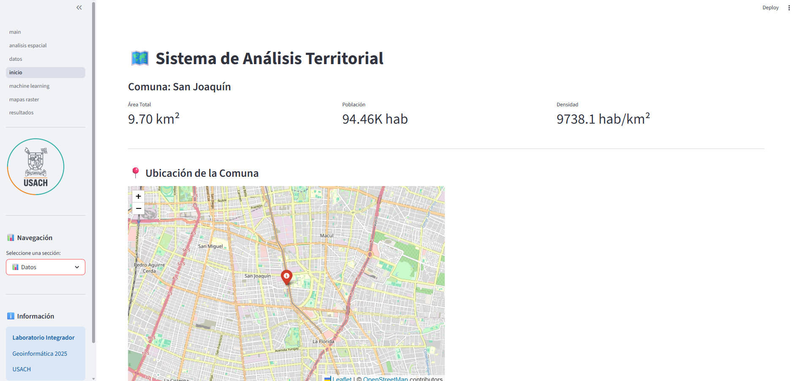
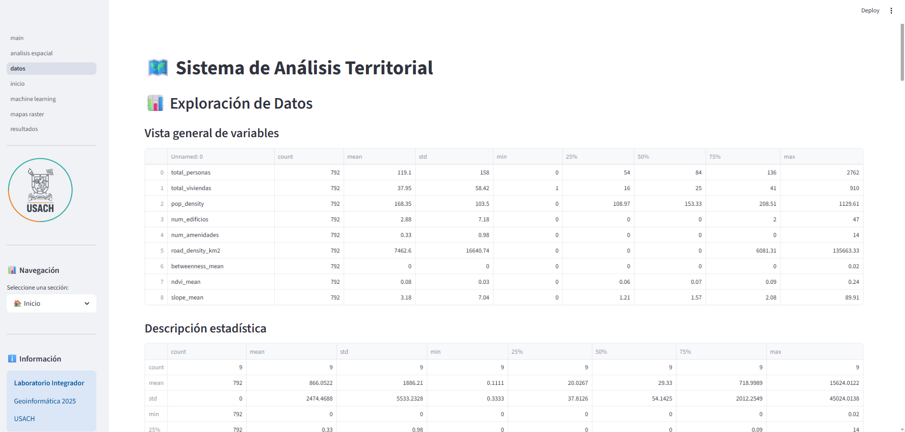
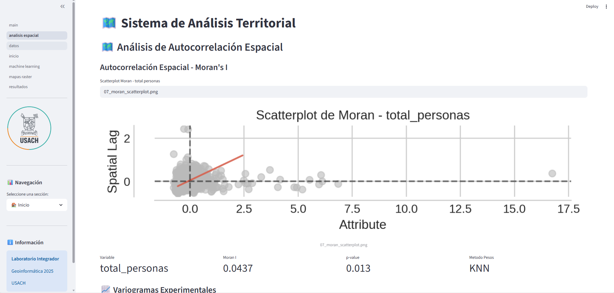
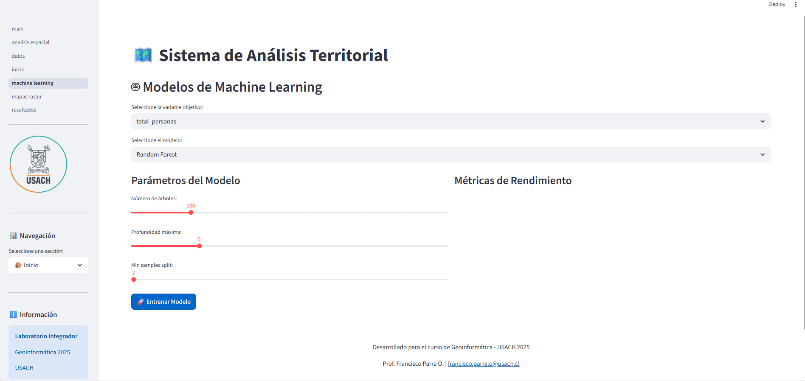
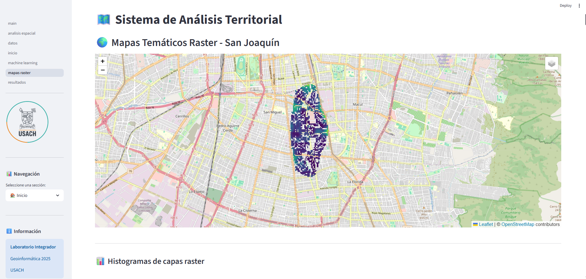
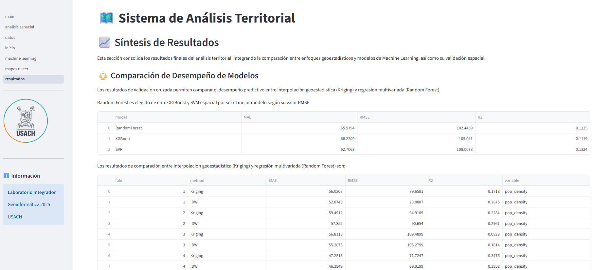

# Acceso a la aplicación Streamlit

## Requisitos previos
* **PostGIS** debe estar activado.  
* Las carpetas **figures y models** de carpeta `outputs/` deben de estar con contenido.  
  * Para generarlos es necesario ejecutar todos los notebooks: `01_data_acquisition.ipynb`, `02_exploratory_analysis.ipynb`, `03_geostatistics.ipynb`, `04_machine_learning` y `05_results_synthesis`.

Lo primero se debe a que la aplicación extrae información directamente desde la base de datos. Lo segundo corresponde a la recuperación de imágenes y archivos generados en los notebooks. Si estos elementos no están disponibles, los resultados no podrán visualizarse en la página.

---

## Ejecución local
Para poder ejecutarlo de manera local se necesita cambiar DB_HOST de components/dataset.py a **localhost**

Luego, se debe ejecutar este comando desde la raíz del proyecto:

```bash
streamlit run ./app/main.py 

```
La aplicación estará en el puerto habilitado http://localhost:8501/

## Ejecución Docker
Para poder ejecutarlo se debe de levantar con un comando desde la raíz del proyecto.

```bash
docker-compose up --build -d

```

La aplicación estará en el puerto habilitado http://localhost:5000/

## Imágenes de la aplicación Streamit











